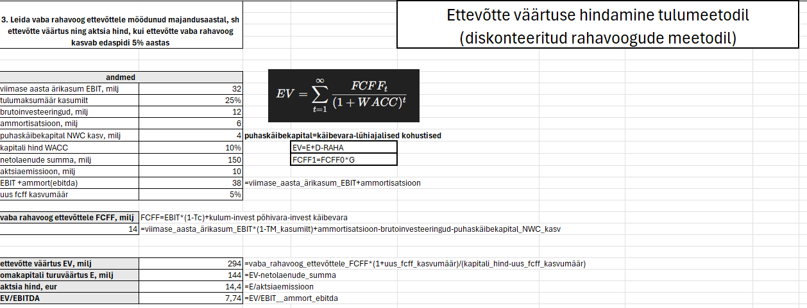
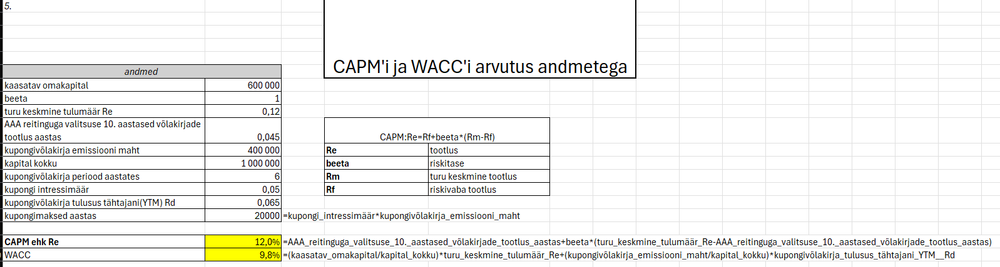
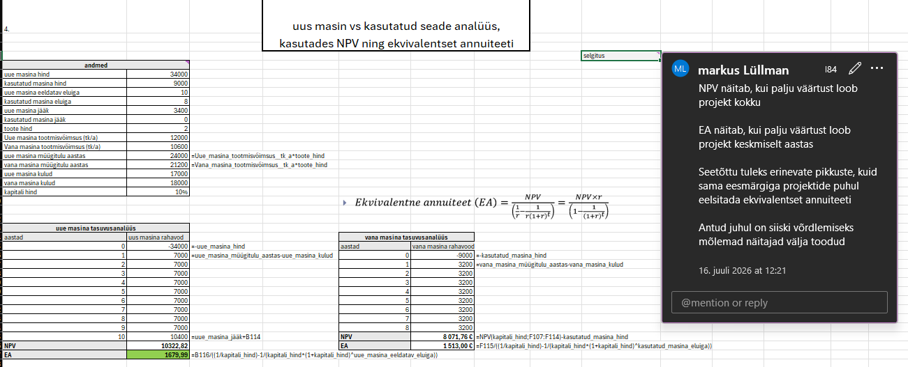

# Ettevõtte rahanduse ja investeeringute hindamise arvutused

Selles kaustas on kogumik Exceli töövihikuid, mis katavad ettevõtte rahanduse (*corporate finance*) ja investeeringute hindamise põhiteemasid — kapitali hinnast ja ettevõtte väärtuse leidmisest kuni investeerimisotsuste tasuvusanalüüsi ja optsioonideni. Kõik mudelid on üles ehitatud valemipõhiselt (nimedega määratletud), mitte fikseeritud arvudega, mistõttu sisendeid muutes arvutab kogu mudel ennast automaatselt ümber.

## Failide ülevaade

| Fail | Peamised teemad |
|---|---|
| **`dividendipoliitika__aktsia_split__optsioonid.xlsx`** | Dividendipoliitika signaalid, aktsiate tagasiost vs dividendid, aktsia split/reverse split ja aktsiadividendi mõju hinnale, dividendide prognoosimine FCFE-meetodil, ostu- ja müügioptsioonide tasuvusanalüüs |
| **`EV_kapitali_hind__võlakirjad__CAPM_ja_WACC_arvutused.xlsx`** | Omakapitali hind (Gordoni mudel), eelisaktsiate ja võlakirjade kaudu kaasatava kapitali hind, tulusus tähtajani (YTM), maksujärgne laenu hind, CAPM ja WACC mitme erineva näite põhjal |
| **`EV_väärtuse_leidmine__DCF_mudel__suhtarvu_analüüs.xlsx`** | Ettevõtte ja aktsia väärtuse leidmine võrdlusgrupi suhtarvude (P/E, P/B, EV/S, EV/EBITDA) mediaanide alusel, fundamentaalsete suhtarvude tuletamine Gordoni mudeliga, DCF-mudel vaba rahavoo (FCFF), terminaalväärtuse ja mitmeaastase prognoosi põhjal |
| **`NPV__IRR_ja_MIRR__ekvivalentne_annuiteet__tasuvuslävi.xlsx`** | NPV, IRR ja diskonteeritud tasuvusaeg seadme väljavahetamise näitel, MIRR vs IRR, ekvivalentne annuiteet (EA) erineva elueaga investeeringute võrdlemiseks, raamatupidamislik ja finantstasuvuslävi ning ekvivalentne aastane kulu (EAC) investeerimisotsuse langetamiseks |

## Kasutatud meetodid

- **Kapitali hind:** CAPM, WACC, Gordoni dividendimudel, YTM
- **Investeeringute hindamine:** NPV, IRR, MIRR, (diskonteeritud) tasuvusaeg, ekvivalentne annuiteet, tasuvuslävi
- **Ettevõtte väärtuse hindamine:** DCF-mudel (FCFF/FCFE), rahandussuhtarvude põhine hindamine
- **Muu:** aktsia split/dividendi mõju analüüs, ostu- ja müügioptsioonide tasuvus, kapitalistruktuuri (D/E) mõju hinnale

## Struktuur

Iga töövihik koosneb nummerdatud ülesannetest, kus lähteandmed ja valemid on eraldi tähistatud ning tulemused on tuletatud nimedega määratletud lahtrite abil ja Exceli valemitega (mitte käsitsi sisestatud arvudega). See võimaldab jälgida iga arvutuse loogikat sammhaaval ja katsetada erinevate sisendite mõju lõpptulemusele.

## Näited

*Ettevõtte väärtuse ja aktsia hinna leidmine DCF meetodil, koos peamiste eeldustega (WACC, kasvumäär).*

*CAPM ja WACC arvutuskäik.*

*Kahe investeerimisvõimaluse võrdlus tuginedes ekvivalentse annuiteedi ning NPV valemitele.*

