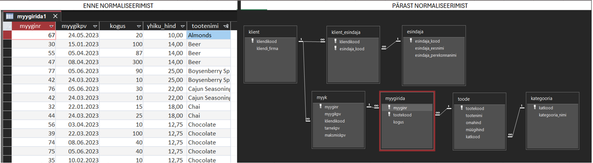
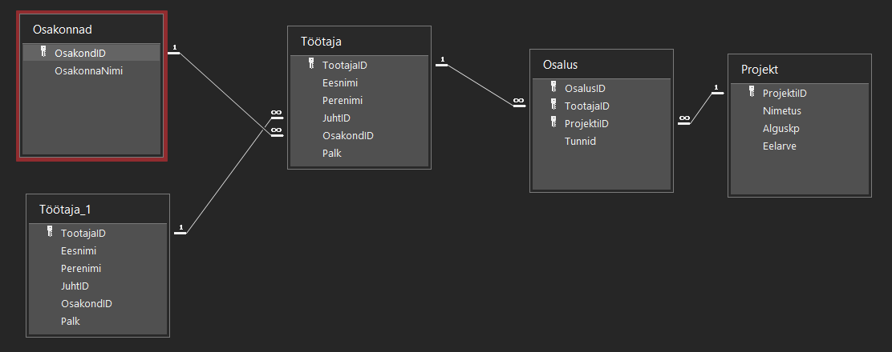
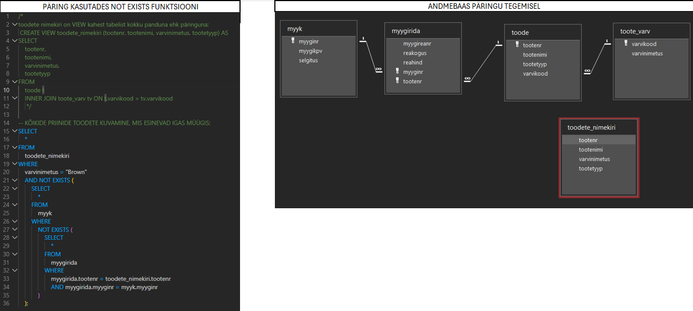

# Andmebaaside disain ja SQL päringud

> 🇬🇧 **English:** **Sample relational databases and SQL scripts** covering relational database design and normalization, including schema design, table creation, JOINs, UNION/INTERSECT operations, relational division (double NOT EXISTS), views, and recursive self-referencing relationships (e.g., organizational hierarchies). Implemented and tested in MS Access and MySQL.

---

Selles repositooriumis on kogumik näidisandmebaase (MS Access `.accdb`) ja SQL-skripte, mis käsitlevad relatsiooniliste andmebaaside kavandamist ja normaliseerimist ning SQL-päringute koostamist — alates andmebaasi ja tabelite loomisest kuni keerukamate päringutüüpideni nagu `JOIN`, `UNION`, `INTERSECT`, `NOT EXISTS` ja rekursiivsed (iseendaga seotud) tabelid.

## Failide ülevaade

| Fail | Sisu |
|---|---|
| **`andmebaasi_loomine.sql`** | Mitme näidisandmebaasi (`sql_invoicing`, `sql_store`, `sql_hr`, `sql_inventory`) struktuuri ja algandmete loov skript — tabelid, primaar-/välisvõtmed ning testandmed, mida kasutatakse alusena teiste päringuülesannete jaoks |
| **`UNION_funktsiooni_kasutamise_päring.sql`** | Näide `UNION` kasutamisest kahe päringutulemuse ühendamiseks — nt tellimuste jagamine kuupäeva alusel "aktiivseteks" ja "arhiveeritud" kirjeteks |
| **`normaliseerimine_ning_andmebaasi_loomine.accdb`** | Andmebaasi normaliseerimise näide (kliendid, esindajad, tooted, müügid) — liikumine normaliseerimata tabelitest normaliseeritud struktuurini koos primaar- ja välisvõtmete, seosetabelitega (many-to-many) ning vaadete ja päringutega müügiandmete kohta |
| **`lihtne_andmebaas_koos_päringutega.accdb`** | Töötajate, projektide ja osakondade andmebaas — tabelite ja seoste loomine (sh töötaja tabeli seos iseendaga juht-alluv struktuuri jaoks), `LEFT JOIN` + `IS NULL`, `UNION` ning koondfunktsioonidega päringud (nt kes on projekti kõige rohkem aega panustanud) |
| **`VIEW__UNION__TOPELT_NOT_EXISTS__INTERSECT_JA_LIKE__kasutamine.accdb`** | Päringud, mis keskenduvad `VIEW`, `UNION`, topelt `NOT EXISTS` (relatsiooniline jagamine), `INTERSECT` ja `LIKE` operaatori kasutamisele toodete/müügi andmebaasis |
| **`rekursiivne_seos.accdb`** | Töötaja tabeli iseendaga seotud (rekursiivne) struktuur juht-alluv hierarhia kuvamiseks, koos vaadete ja päringutega |

## Kasutatud meetodid ja oskused

- **Andmebaasi disain:** normaliseerimine (1NF–3NF), primaar- ja välisvõtmed, üks-mitmele ja mitu-mitmele seosed
- **SQL DDL/DML:** andmebaaside ja tabelite loomine, andmete sisestamine
- **Päringud:** `JOIN` (sh `LEFT JOIN`), `UNION`, `INTERSECT`, `NOT EXISTS` (relatsiooniline jagamine), `LIKE`
- **Vaated (VIEW):** korduvkasutatavate päringute salvestamine vaadetena
- **Rekursiivsed seosed:** iseendaga seotud tabelid (nt juht-alluv hierarhia)
- **Töövahendid:** MS Access (`.accdb`) ja standardne SQL (`.sql`)

## Struktuur ja avamine

`.accdb` failid on MS Access andmebaasid ja avanevad Microsoft Accessis (või ühilduvas tarkvaras); igas failis on nii tabelid kui salvestatud päringud/vaated, mida saab otse käivitada. `.sql` failid on tavalised tekstipõhised skriptid, mida saab kuvada faili peale vajutades. `.sql` päringud käivituvad mis tahes MySQL-ühilduvas keskkonnas (nt MySQL Workbench), ning neid saab katsetada luues esmalt andmebaasi "**andmebaasi_loomine.sql**" päringu abil.

## Näited

*Tabel enne normaliseerimist ning hiljem valmis saanud andmebaasis.*

*Andmebaas juht-alluv seosega, kus tabel viitab iseendale.*

*SQL päringus "exists" funktsiooni rakendamine koos vaate loomise ning andmebaasi skeemiga.*

