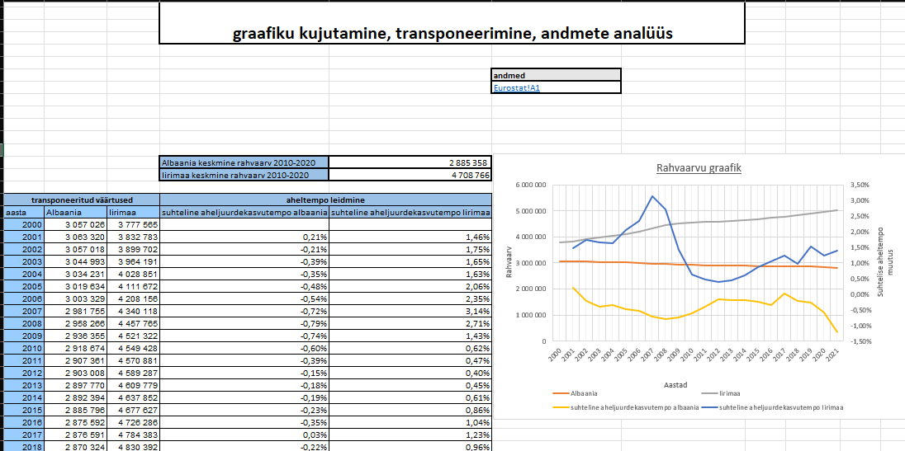
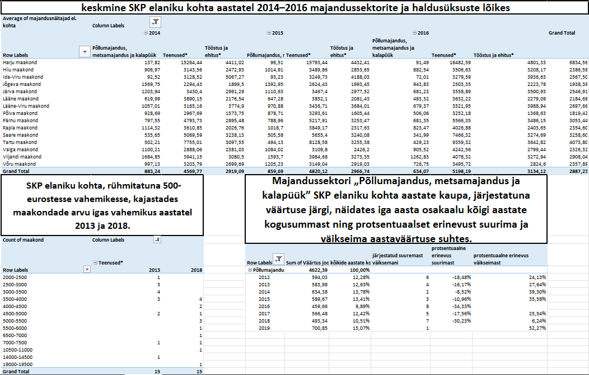
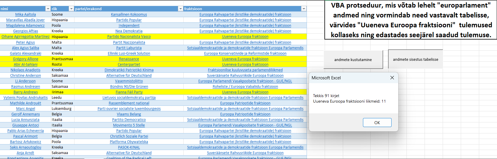

# Excel ja VBA projektid

> 🇬🇧 **English:** **Sample Excel and VBA projects** covering spreadsheet-based data analysis and automation, including advanced Excel formulas, PivotTables, Advanced Filter, Data Validation, What-If Analysis, charts, user-defined functions (UDFs), event-driven programming, and VBA automation. Projects demonstrate data processing, visualization, web data integration, and workflow automation using Microsoft Excel.

---

Selles repositooriumis on kogumik Exceli töövihikuid (.xlsx ja .xlsm), mis käsitlevad andmetöötlust ja automatiseerimist Excelis — alates valemipõhisest andmeanalüüsist kuni PivotTable'ite, Advanced Filteri, What-If Analysis tööriistade ning VBA programmeerimiseni. Projektid demonstreerivad Exceli võimalusi andmete analüüsimisel, visualiseerimisel ja automatiseerimisel, hõlmates valemite, sisseehitatud tööriistade ja VBA programmeerimise praktilist rakendamist.

## Failide ülevaade

| Fail | Sisu |
|---|---|
| **`countif__sumif__indexmatch.xlsx`** | Exceli valemitele keskenduv töö, kus kõik ülesanded on lahendatud ilma sortimise, filtreerimise ja PivotTable'it kasutamata. Kasutatud on teksti-, otsingu-, statistilisi ja tingimusfunktsioone, samuti diagramme ning valemitega andmete analüüsi. |
| **`pivottable__datatable__advanced_filter.xlsx`** | Töö keskendub Exceli sisseehitatud andmetöötlusvahenditele, sealhulgas PivotTable'itele, Advanced Filterile, Subtotalile, Data Validationile ja What-If Analysis (Data Table) tööriistadele. |
| **`funktsioonide_loomine___advanced_filter_VBA.xlsm`** | VBA programmeerimise põhioskusi demonstreeriv töö, mis sisaldab kasutaja defineeritud funktsioone (UDF), makrosid, sündmuspõhist programmeerimist ning Advanced Filteri automatiseerimist. |
| **`automatiseerimine__bussiajad_VBA.xlsm`** | Kõige mahukam töö, mis ühendab Exceli valemid, sisseehitatud tööriistad ja VBA automatiseerimise. Sisaldab veebiandmete importimist, sündmuspõhist programmeerimist, dünaamilist tabelite loomist ning mitme andmeallika ristkontrolli. |

## Kasutatud meetodid ja oskused

- **Exceli valemid:** `INDEX`, `MATCH`, `COUNTIF`, `SUMIF`, `SUMIFS`, `IF`, `SMALL`, `MINIFS`, teksti-, kuupäeva- ja statistilised funktsioonid
- **Andmetöötlus:** PivotTable, Advanced Filter, Subtotal, Excel Table, Data Validation
- **What-If Analysis:** Data Table tundlikkusanalüüs
- **Visualiseerimine:** diagrammid ja kaheteljelised graafikud
- **VBA programmeerimine:** kasutaja defineeritud funktsioonid (UDF), makrod, sündmuspõhine programmeerimine (`Worksheet_Activate`), dünaamilised vahemikud (`CurrentRegion`), lahtrite vormindamine ja filtreerimine programmiliselt
- **Andmete import ja automatiseerimine:** veebiandmete töötlemine, tabelite automaatne koostamine ning mitme andmeallika ühendamine

## Struktuur ja avamine

`.xlsx` failid sisaldavad valemite ja Exceli sisseehitatud tööriistade abil koostatud lahendusi ning avanevad Microsoft Excelis.

`.xlsm` failid sisaldavad lisaks VBA makrosid. Nende kasutamiseks tuleb töövihiku avamisel lubada makrode käivitamine (**Enable Content / Luba sisu**). VBA lähtekoodi saab vaadata Excelis menüüst **Developer → Visual Basic** (`Alt + F11`).

Kõik töövihikud sisaldavad töölehtede alguses lühikirjeldusi ning eraldi nimetatud vahemikke lähteandmete (**ANDMED**) ja arvutuste (**ARVUTUSED** / **VALEMID**) jaoks.

Lisaks töövihikutele sisaldab repositoorium VBA lähtekoodi (.bas ja .cls), mis võimaldab makrode ja kasutaja defineeritud funktsioonide koodi sirvida otse GitHubis, ilma Exceli töövihikuid avamata.

Õppeotstarbel kasutatud isikuandmed ("Personal", "Töötajad", "Inimesed" jt töölehed) on väljamõeldud.

## Näited

*Rahvaarvu ja aheljuurdekasvutempo kuvamine ühel diagrammil sekundaartelje abil.*

*Kolm liigendtabelit SKP andmetest: keskmine SKP sektorite ja maakondade lõikes (tabel A), SKP rühmitatuna 500-eurostesse vahemikesse (tabel B) ja põllumajandussektori SKP aastate kaupa koos järjestuse, osakaalu ning suurima ja väikseima aastaväärtuse protsentuaalse erinevusega. (tabel C).*

*VBA protseduur, mis kopeerib Euroopa Parlamendi liikmete andmed, vormindab need automaatselt tabeliks, tõstab tingimusele vastavad kirjed esile ning kuvab kokkuvõtte töödeldud tulemustest.*

