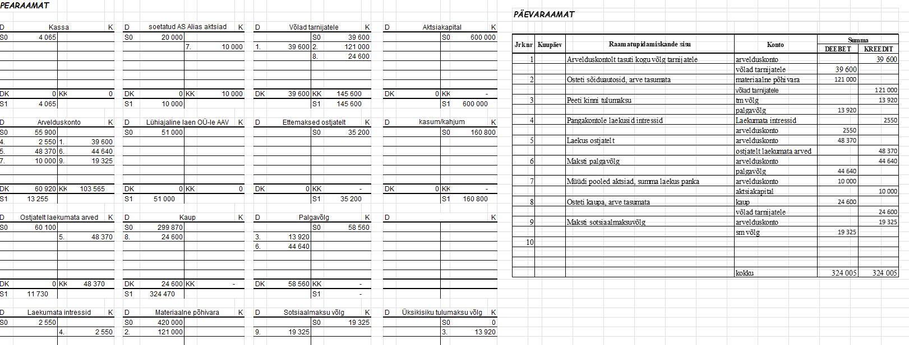
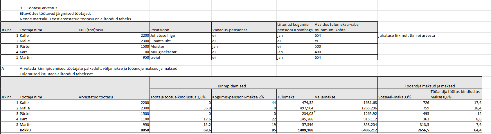
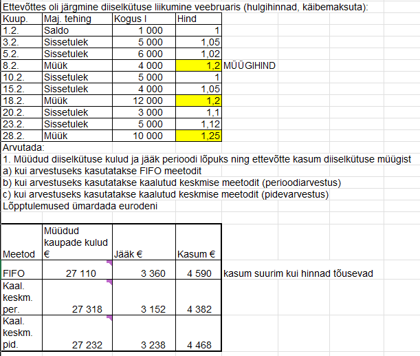

# Raamatupidamise põhitõdede ülesanded

> 🇬🇧 **English:** Excel workbooks covering the complete accounting cycle, from transaction analysis and journal entries to T-accounts, trial balance, and balance sheet preparation. Also includes period-end adjustments, FIFO and weighted-average inventory valuation, and payroll, vacation-pay, and VAT accounting. Formula-linked worksheets ensure all calculations update automatically as source data changes.

---

Selles repositooriumis on kogumik Exceli töövihikuid, mis katavad finantsarvestuse (raamatupidamise) põhiprotsesse — algbilansi koostamisest ja kahekordsest kirjendamisest kuni korrigeerimiskannete, laovarude hindamise ja palgaarvestuseni. Enamik ülesandeid läbib täieliku raamatupidamistsükli: majandustehingu analüüs → lausend → päevaraamat → T-konto (pearaamat) → käibeandmik → bilanss.

## Failide ülevaade

| Fail | Peamised teemad |
|---|---|
| **`bilansside_loomine__T-kontod__päevaraamatu_täitmine.xlsx`** | Algbilansi koostamine kontojääkide alusel, kontode avamine pearaamatus (T-kontod), majandustehingute kirjendamine päevaraamatus ja T-kontodel, käibeandmiku ja lõppbilansi koostamine — täielik raamatupidamistsükkel ühe kuu näitel |
| **`kahekordne_kirjendamine__T-kontod__päevaraamatu_täitmine.xlsx`** | Kahekordse kirjendamise põhimõte: majandustehingute analüüs ja lausendite koostamine, päevaraamatu ja T-kontode täitmine, käibeandmiku ning bilansi koostamine kontojääkide põhjal |
| **`korrigeerimis-_ja_reguleerimiskannete_ülesanded.xlsx`** | Perioodi lõpu korrigeerimiskanded: kogunenud (võlgnetavad ja laekumata) intressid, ettemakstud kulud, paranduskanded ekslike kirjendite jaoks, põhivara amortisatsiooni arvestus (lineaarne meetod) ja jääkmaksumuse leidmine |
| **`FIFO_meetod.xlsx`** | Laovarude hindamine erinevate meetoditega — FIFO ja kaalutud keskmine hind (nii perioodi- kui pidevarvestuses) — müüdud kauba kulu (COGS), lõppjäägi ja kasumi arvutamine ning meetodite tulemuste võrdlus |
| **`töötasude__puhkustasude_ja_lühiajaliste_kohustiste_arvestus.xlsx`** | Palgaarvestus (tulumaks, sotsiaalmaks, töötuskindlustus- ja kogumispensionimaksed), puhkusetasu ja puhkusetasueraldise arvestus, käibemaksuarvestus ja -võla leidmine, garantiieraldise moodustamine |

## Kasutatud meetodid ja oskused

- **Raamatupidamise põhitsükkel:** kahekordne kirjendamine, päevaraamatu ja pearaamatu (T-kontode) pidamine, käibeandmiku ja bilansi koostamine
- **Korrigeerimised:** tulude ja kulude vastavuse printsiibi rakendamine (kogunenud ja ettemakstud tulud ning kulud), paranduskannete koostamine ja põhivara amortisatsiooni arvestamine.
- **Laovarude arvestus:** FIFO ja kaalutud keskmise hinna meetod
- **Töötasude arvestus:** palga-, sotsiaalmaksu-, tulumaksu- ja puhkusetasuarvestus, eraldiste (puhkusetasu, garantii) moodustamine
- **Käibemaksuarvestus:** ostu- ja müügiarvete käibemaks, käibemaksuvõla arvutamine

## Struktuur

Mitmeosalised töövihikud (nt algbilanss → päevaraamat → T-kontod → käibeandmik → lõppbilanss) on üles ehitatud eraldi lehtedena, mis peegeldab raamatupidamistsükli tegelikku käiku ja võimaldab jälgida, kuidas üks majandustehing liigub lausendist lõpparuandeni. Arvutused põhinevad valemitel, mistõttu lähteandmeid muutes uuenevad tulemused automaatselt kõigil seotud lehtedel.

## Näited

*T-kontode täitmine päevaraamatu ning tehtud tehingute alusel.* 

*Palga arvestamine koos kinnipidamistega ning arvutuskäiguga.* 

*Laovarude hindamine FIFO ning kaalutud keskmise arvestuse meetodil — lõppjääk, kasum ja müüdud kauba kulu (COGS).*

